# Node JS: Advanced Concepts

* Nodejs is separated in two dependencies

  * v8: An open source JS engine created by google. Its main purpose is to execute JS code outside of the browser

    * V8 compiles JavaScript directly to native machine code before executing it, instead of more traditional techniques such as interpreting bytecode or compiling the whole program to machine code and executing it from a filesystem. The compiled code is additionally optimized (and re-optimized) dynamically at runtime, based on heuristics of the code's execution profile. Optimization techniques used include inlining, elision of expensive runtime properties, and inline caching. The garbage collector is a generational incremental collector.

  * libuv: A c++ open source project that gives node access to the operating system underline file system, networking and some aspects of concurrency.
  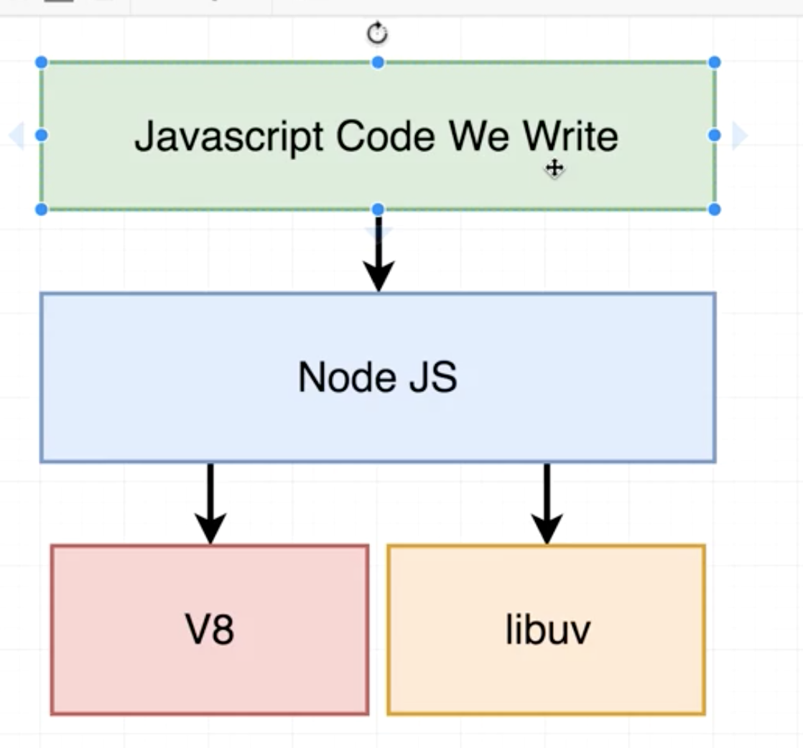


* Nodejs gives us a nice interface to use to related the JS side of our application to the C++ side of things. Node also provides a series of wrappers (fs, crypto, etc..)

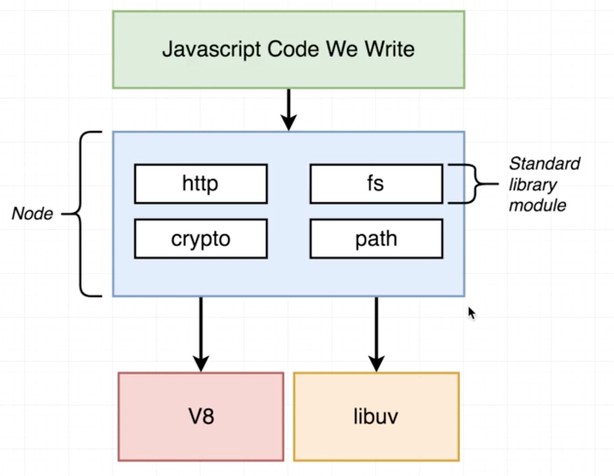

* Inside the Node repo we can find two main folders (https://github.com/nodejs/node)
  * ```lib```: is where all the JS code is located
    * Example: https://github.com/nodejs/node/tree/master/lib/internal/crypto/pbkdf2.js
    * This file is mostly validating inputs and forwarding this to the C++ function
    ```javascript
    const {
      PBKDF2
    } = process.binding('crypto');
    const ret = PBKDF2(password, salt, iterations, keylen, digest);
    ```
    * ```process.binding```: It's a feature that essentially goes out and grab the C++ feature and make it available inside the javascript

  * ```src```: is where all the C++ is located, and where node pulls ```libuv``` and ```v8```

    * ```PBKDF2``` is located inside  https://github.com/nodejs/node/blob/master/src/node_crypto.cc

    * 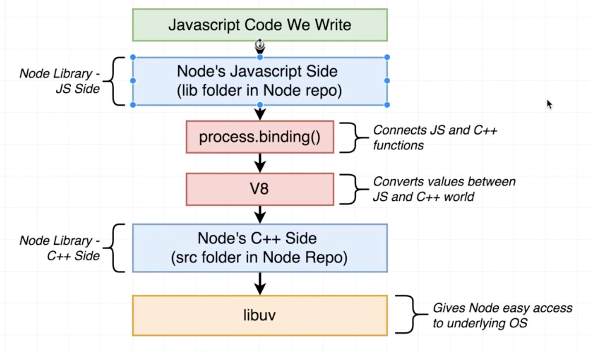

    ```
    env->SetMethod(target, "PBKDF2", PBKDF2);

    void PBKDF2(const FunctionCallbackInfo<Value>& args) {
    Environment* env = Environment::GetCurrent(args);

    const EVP_MD* digest = nullptr;
    int keylen = -1;
    ```

## Process and Threads

* Process: Instance of a computer program that is being executed
  * A process can have multiple threads.
  * Threads are tasks that need to be executed (ex: read database, read file, multiple numbers, etc..)
  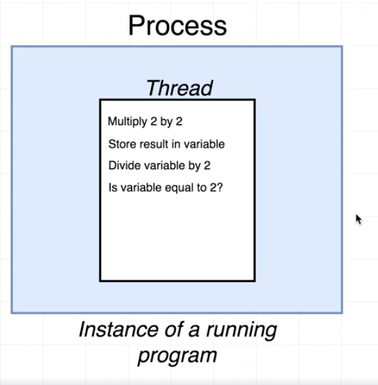
  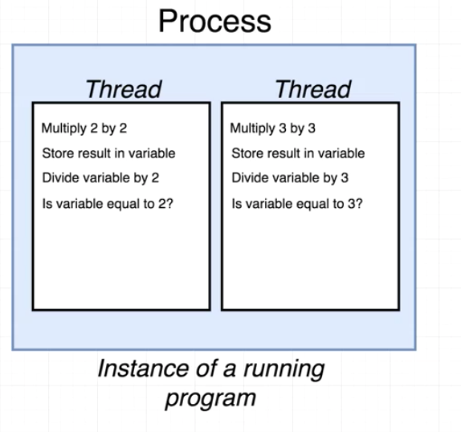

* Scheduling: Which thread to process at any giving instant in time
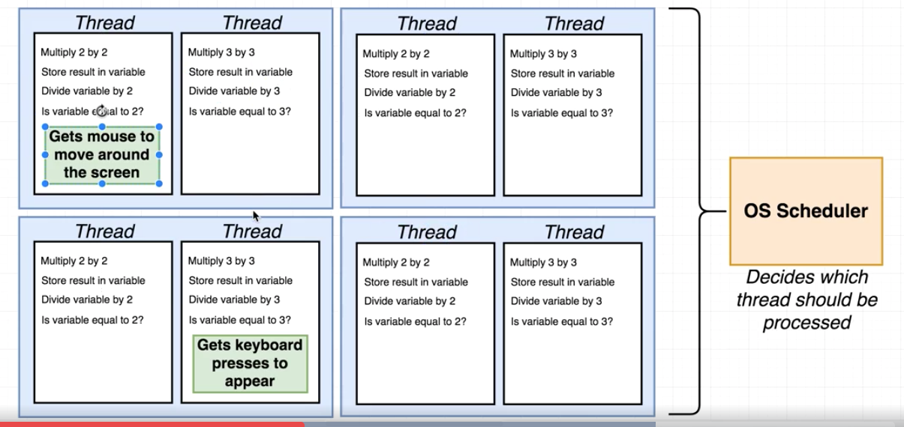
* Urgent threads should not wait to long to be executed. (moving the mouse thread)
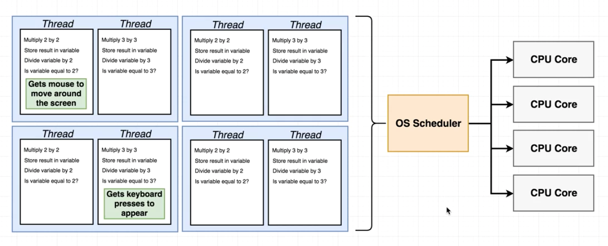
* One core can process more than one thread at a time (multithreading or hyper-threading)

## The Event Loop

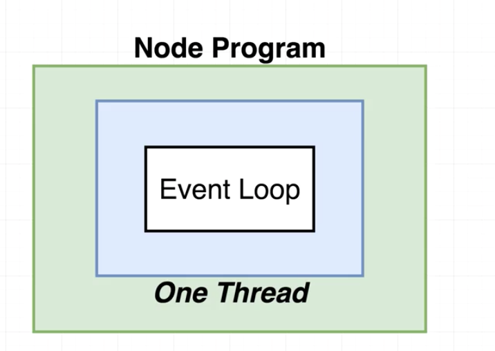

```
--> PSEUDO CODE

// Start: node myfile.js

// myFile.runContents(): First node takes the content of myfile.js and executes it

// New timers, tasks, operations are recorded from myfile running
const pendingTimers = [];
const pendingOSTasks = [];
const pendingOperations = [];

function shouldContinue() {
  // Check one: Any pending setTimeout, setInterval, setImmediate?

  // Check two: Any pending OS tasks? (Like server listening to port)

  // Check Three: Any pending long running operations? (Like fs module)

  return pendingTimers.length || pendingOSTasks.length || pendingOperations.length;
}

// Now we are inside the event loop
// Every single time the event loop runs inside our app, that is called a 'tick'

while(shouldContinue()) {
  // 1) Node looks at pendingTimers and sees if any functions are ready to be called. setTimeout, setInterval

  // 2) Node looks at pendingOSTasks and pendingOperations and calls relevants callbacks (this is 99% of our code)

  // 3) Pause execution. Continue whenever...
  // - a new pendingOSTask is done
  // - a new pendingOperation is done
  // - a timer is about to complete

  // 4) Look at pendingTimers. Call any setImmediate

  // 5) Handle any 'close' events
  // Example: readSteam
  // readSteam.on('close', () => { console.log("clean up") })

}

// End: exit back to terminal
```

### Pending Operations

* The Event loop runs in a single thread, but a lot of node libs are actually NOT single threaded. They run outside of the event loop / the single thread
  * ```node threads.js```
  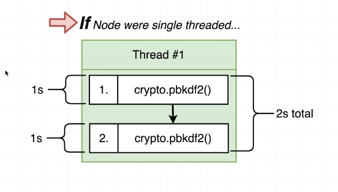
  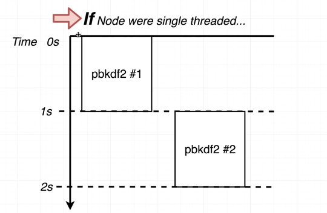
  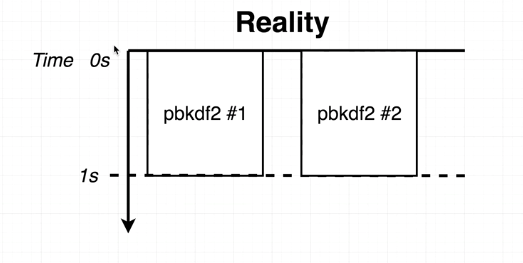
  
  * For some very particular functions inside the STD lib, the Node C++ / libuv side of things decide to make expensive calculations outside of the event loop.
  * To do that, they make use of something called a Thread Pool
    * Series of 4 threads used for computation intensive tasks
    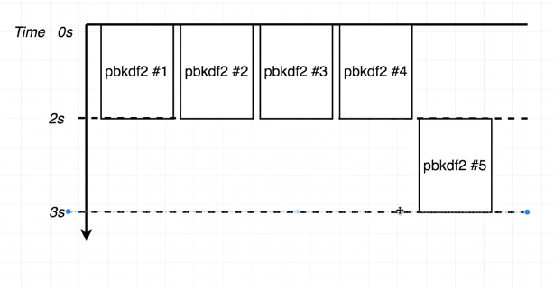
    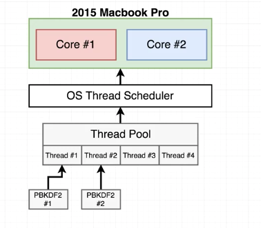
    
    * Our cores in this example can process only 2 threads at a time
    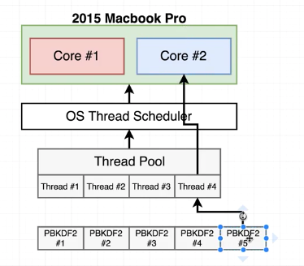
    * That explains why the first four calls took 2s (2 threads running inside one core) vs 1s (1 thread running in one core -- more resources)
  * Lets resize our Thread pool from libuv to only take 2 threads at a time
    * ```process.env.UV_THREADPOOL_SIZE = 2;```
    
    
    * ```process.env.UV_THREADPOOL_SIZE = 5;```
    
    
    * The OS scheduler plays the threads in a way that even with 2 cores (4 threads total), we still have similar times for all five (almost 2s each)


### Pending OS Tasks

* Check ```node async.js```
  * We notice that all requests are ending in an approximate time
  
  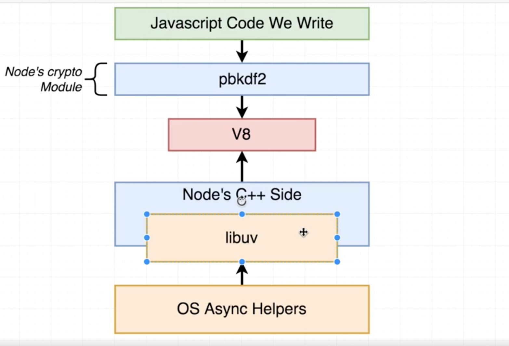
  * Those tasks are not related to the Thread Pull from libuv. Libuv is calling OS functions to handle it. Neither libuv nor node has code to handle network requests, it delegates it to the underline operating system.
  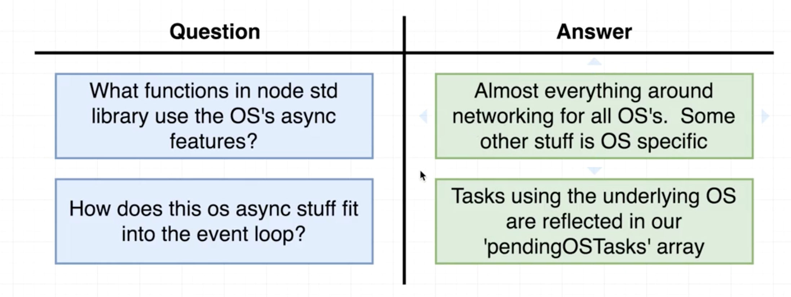

### Summarizing the Event Loop
  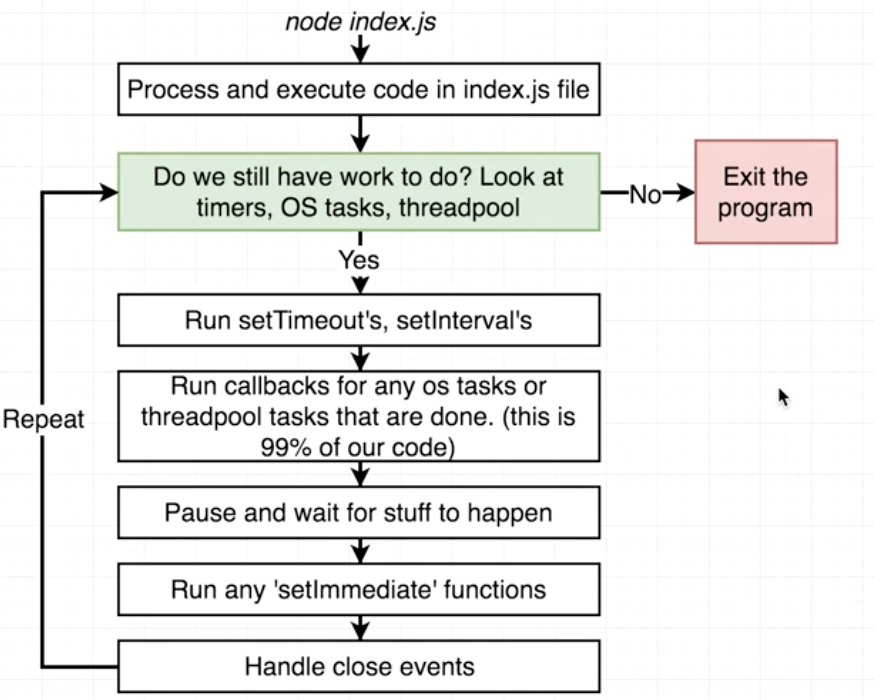

### Interview Question

* Run ```node multitask.js```


* HTTPs is not using the thread pool at all, it is using the underline OS functionality.
* FS will first make a file system call to get some file stats.
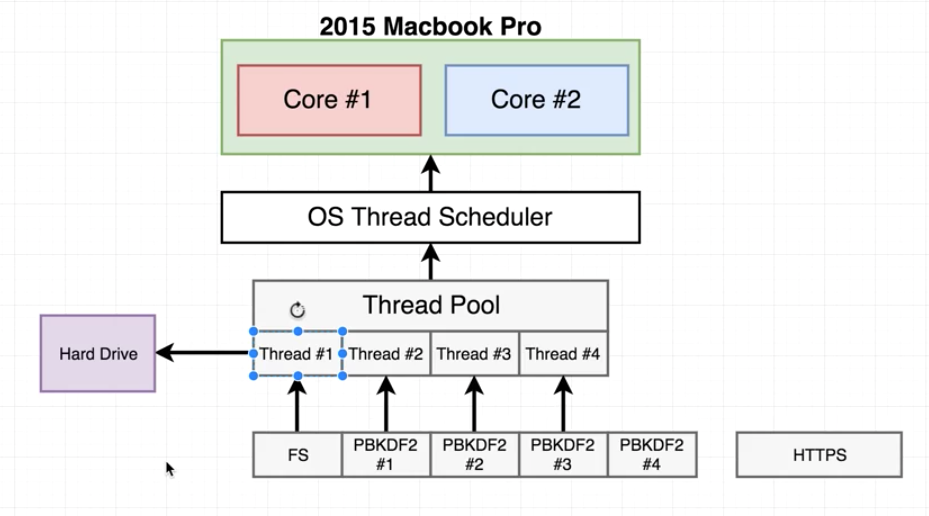
* During that call the OS scheduler will notice that it needs to wait for an HD read operation. On that note, the OS will free Thread#1 for another operation to use that processing time.
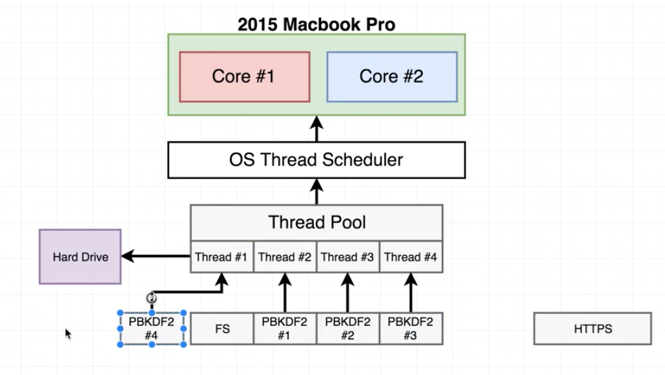
* After Thread#1 is taken over by one of the PBKDF2 operations, some other PBKDF2 operation will eventually end processing. This will lead to a new space in our tread pool, and that space will be used by the ```fs``` operation to keep its execution.

* The HD then takes over an returns those file ```stats``` that we required previously.
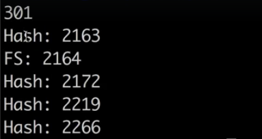
* First the network request executes (it does not use the thread pool), then both ```crypto``` and ```fs``` libs makes use of the thread pool of 4 slots. They filled it up with 3 PBKFS calls and the stats request from ```fs``` looking for the ```multitask.js``` file.
  * After ```fs``` required the file stats, it frees one Thread inside the pool, and that gives space for PBKFS to execute.
  * Finally, one of the 4 PBKFSs finish processing, and the slot is then taken by ```fs``` to request the actual file data and return it to the user.


## Cluster mode vs Worker Thread

* Cluster mode: is used to start of multiple copies of node that all running your server inside them. We cannot trigger node start multiple threads, but multiple copies we get multiple instances of the event loop (kind of multi threaded)
  * Recommended

* Worker threads: They will use the Thread Pool from libuv
  * Experimental

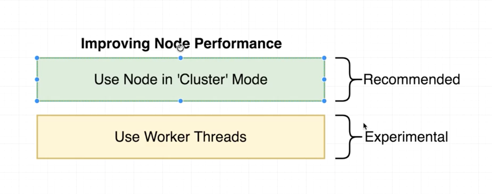

* Check ```cluster/index.js````
  * We can use ```ab``` apache benchmark to test our cluster
  * ```ab -c 1 -n 1 localhost:3000/```
  * ```-c```: concurrent requests
  * ```-n```: number of requests

## PM2 (Process Manager)

* ```npm install -g pm2```
  * This is a cluster manager solutions (managing the health of a cluster)
  * If one of your instances ever crashes, it will restart it for you
  * ```pm2 start pm2.js -i 0```: With i = 0, PM2 will set the number of instances equal to the number of logical CPU cores in your computer.
    * ```pm2 list```: Show basic information about your cluster
    * ```pm2 show pm2```: To see details about our running processes
    * ```pm2 monit```: To see details about each process
    * ```pm2 delete pm2```: Will remove all the running children

## Worker Threads

  * Similar to webworkers
  * Experimental
  * Uses the Thread pool (libuv)
  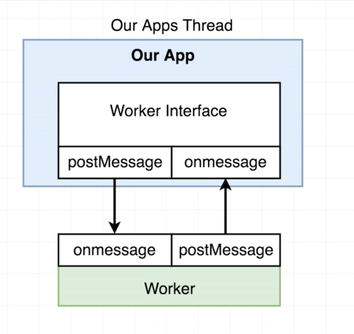


